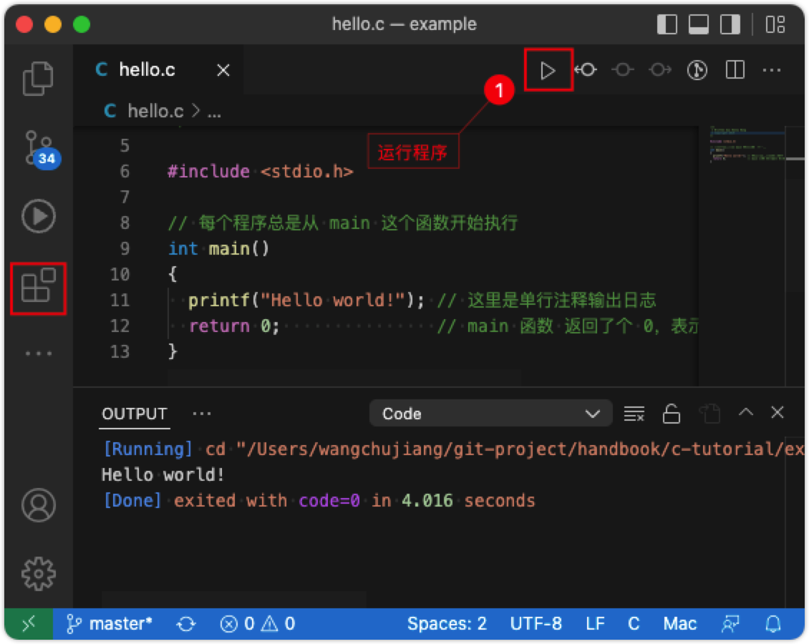

开始使用 C
===

要开始使用 C，您需要做两件事：

- 用于编写 C 代码的文本编辑器，如记事本
- 编译器，如 GCC，将 C 代码翻译成计算机可以理解的语言

有许多文本编辑器和编译器可供选择。 我们介绍几种编辑器和编译环境（见下文）。

注意 ⚠️ ：Linux 和 Mac 系统可以直接安装 GCC，Windows 系统可以安装 MinGW。

## 编辑器

### Visual Studio Code

[](https://code.visualstudio.com)

VSCode 下载安装地址：https://code.visualstudio.com

下载安装好 [VSCode](https://code.visualstudio.com) 后，我们需要安装下面两个插件更方便的支持 C 语言环境。

- [C/C++ Extension Pack](https://marketplace.visualstudio.com/items?itemName=ms-vscode.cpptools-extension-pack)
- [Code Runner](https://marketplace.visualstudio.com/items?itemName=formulahendry.code-runner)

### Sublime Text 3

[](https://www.sublimetext.com)

Sublime Text 下载安装地址：https://www.sublimetext.com

## C 快速入门

如果您不理解下面的代码，请不要担心 —— 我们将在后面的章节中详细讨论。 现在，专注于如何运行代码。

### 创建第一个程序

让我们创建我们的第一个 C 文件。

打开编辑器选择菜单 `File` > `New File` 创建一个空的文本文件。

编写以下 C 代码并将文件另存为 `hello.c`（`File` > `Save As`）：

```c
#include <stdio.h>

int main() {
  printf("Hello World!");
  return 0;
}
```

### 编辑器编译运行

在 [Visual Studio Code](https://code.visualstudio.com) 中，它应该如下所示：


然后，点击 `Run Code` 以运行（执行）程序。 结果看起来像这样：

```bash
[Running] cd "/Users/c-tutorial/example/" && gcc hello.c -o hello && "/Users/c-tutorial/example/"hello
Hello world!
[Done] exited with code=0 in 4.016 seconds
```

在 Sublime Text 3 中，运行比较简单，打开 `hello.c` 文件，`Tool` > `Build` 选择 `C Single File - Run`，它应该如下所示：

[](https://www.sublimetext.com)

### 命令行编译运行

通过命令行进入 `hello.c` 所在目录

```bash
cd /Users/c-tutorial/example
```

使用 `gcc` 编译 `hello.c` 文件，

```bash
$ gcc -o hello hello.c
```

运行成功之后会在当前目录下看到 hello 文件，直接在命令后输入 `./hello` 命令，您将得到如下输出结果：

```bash
Hello World
```

### Docker 运行环境

可以简单用 Docker 来安装编译环境，这样在 Windows、MacOS、Linux 下都可以拥有完全相同的编译环境。

镜像基于 Alpine Linux 镜像，只有 5MB 镜像，并且包含 C/C++ 编译器（gcc/g++ 包）

1) 安装 Docker
2) 使用 docker pull 命令
    ```bash
    docker pull frolvlad/alpine-gxx
    ```
3) 创建 Dockerfile 文件
    ```docker
    FROM alpine:3.14
    RUN apk add --no-cache gcc musl-dev
    RUN apk add --no-cache g++
    ```
4) 生成本地镜像
    ```bash
    docker build -t myalpine .
    ```
5) 运行映像，把当前路径（$PWD）映射至容器的 /test 目录，用 gcc 编译程序，exit返回：
    ```shell
    docker run -it -v$PWD:/test myalpine
    root@b1a38bd7107a:/# cd test
    root@b1a38bd7107a:/test# gcc -o hello hello.c
    Hello World
    root@b1a38bd7107a:/test# exit
    exit
    ```